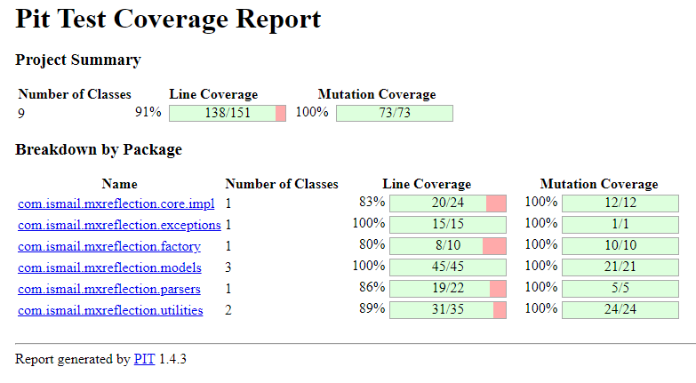

# MXReflection  
A Java math framework based on [mXparser library](http://mathparser.org/) capabilities. 

You can calculate complex mathematical operations and functions with Java, just by using class-related fields, MXReflection reads values from the assigned fields and injects the results in the `@Expression` annotated fields.

 - With `@Arg`  value, we can assign customized argument names to be used in the target function.
 - `@Expression` annotation value contains the function expression with the arguments.

First example:

    class Example1 {
    
        @Arg("f1")
        String field1;
    
        @Arg("f2")
        int field2;
    
        @Expression("f1 * sin(f2) * log2(f1 + f2) + der(cos(f1), f1) * pi + int(tan(f2), f2, 0, e)")
        double field3;
    
    }
    
    @Test
    public void exampleTest() {
        
        Example1 example1 = new Example1();
        example1.field1 = "2.2";
        example1.field2 = 5;
        
        Calculator<Example1> calculator = MXFactory.createCalculator(Example1.class);
        calculator.calculate(example1);
        System.out.println("Field 3 result: " + example1.field3);
    }

Output:

    Field 3 result: -34.32819235851987 

## Supported math collection

MXReflection supports all the [math collection](http://mathparser.org/mxparser-math-collection/) available in mXparser math library:

- [Operators](http://mathparser.org/mxparser-math-collection/operators/) (+, -, *, /, #, !, ^)
- [Binary Relations](http://mathparser.org/mxparser-math-collection/binary-relations/) (=, ==, =<, =>, <, >, <>, !=, ~=)
- [Boolean Operators](http://mathparser.org/mxparser-math-collection/boolean-operators/) (&, &&, /\, ~&, ~&&, ~/\, |, ||, \/, ~|, ~||, ~\/, (+), -->, <--, -/>, </-, <->, ~)
- [Bitwise Operators](http://mathparser.org/mxparser-math-collection/bitwise-operators/) (@~, @&, @^, @|, @<<, @>>)
- [Unary Functions](http://mathparser.org/mxparser-math-collection/unary-functions/) (sin, cos, tan, tg, ctan, ctg, cot, sec, cosec, csc, asin, arsin, arcsin, acos, arcos, arccos, atan, arctan, atg, arctg, actan, arcctan, actg, arcctg, acot, arccot, ln, log2, log10, rad, exp, sqrt, sinh, cosh, tanh, tgh, ctanh, coth, ctgh, sech, csch, cosech, deg, abs, sgn, floor, ceil, not, asinh, arsinh, arcsinh, acosh, arcosh, arccosh, atanh, arctanh, atgh, arctgh, actanh, arcctanh, acoth, arcoth, arccoth, actgh, arcctgh, asech, arsech, arcsech, acsch, arcsch, arccsch, acosech, arcosech, arccosech, sinc, Sa, Sinc, Bell, Luc, Fib, harm, ispr, Pi, Ei, li, Li, erf, erfc, erfInv, erfcInv, ulp)
- [Binary Functions](http://mathparser.org/mxparser-math-collection/binary-functions/) (log, mod, C, Bern, Stirl1, Stirl2, Worp, Euler, KDelta, EulerPol, Harm, rUni, rUnid, round, rNor)
- [3-args Functions](http://mathparser.org/mxparser-math-collection/3-args-functions/) (if, chi, CHi, Chi, cHi, pUni, cUni, qUni, pNor, cNor, qNor)
- [Variadic Functions](http://mathparser.org/mxparser-math-collection/variadic-functions/) (iff, min, max, ConFrac, ConPol, gcd, lcm, add, multi, mean, var, std, rList)
- [Iterated Operators](http://mathparser.org/mxparser-math-collection/iterated-operators/) (sum, prod, avg, vari, stdi, mini, maxi)
- [Calculus Operators](http://mathparser.org/mxparser-math-collection/calculus-operators/) (int, der, der-, der+, dern, diff, difb)
- [Math Constants](http://mathparser.org/mxparser-math-collection/constants/) (pi, e, [gam], [phi], [PN], [B*], [F'd], [F'a], [C2], [M1], [B2], [B4], [BN'L], [Kat], [K*], [K.], [B'L], [RS'm], [EB'e], [Bern], [GKW'l], [HSM's], [lm], [Cah], [Ll], [AG], [L*], [L.], [Dz3], [A3n], [Bh], [Pt], [L2], [Nv], [Ks], [Kh], [FR], [La], [P2], [Om], [MRB], [li2], [EG])
- [Physical Constants](http://mathparser.org/mxparser-math-collection/physical-constants/) ([c], [G.], [g], [hP], [h-], [lP], [mP], [tP])
- [Astronomical Constants](http://mathparser.org/mxparser-math-collection/astronomical-constants/) ([ly], [au], [pc], [kpc], [Earth-R-eq], [Earth-R-po], [Earth-R], [Earth-M], [Earth-D], [Moon-R], [Moon-M], [Moon-D], [Solar-R], [Solar-M], [Mercury-R], [Mercury-M], [Mercury-D], [Venus-R], [Venus-M], [Venus-D], [Mars-R], [Mars-M], [Mars-D], [Jupiter-R], [Jupiter-M], [Jupiter-D], [Saturn-R], [Saturn-M], [Saturn-D], [Uranus-R], [Uranus-M], [Uranus-D], [Neptune-R], [Neptune-M], [Neptune-D])
- [Random Variables](http://mathparser.org/mxparser-math-collection/random-variables/) ([Uni], [Int], [Int1], [Int2], [Int3], [Int4], [Int5], [Int6], [Int7], [Int8], [Int9], [nat], [nat1], [nat2], [nat3], [nat4], [nat5], [nat6], [nat7], [nat8], [nat9], [Nat], [Nat1], [Nat2], [Nat3], [Nat4], [Nat5], [Nat6], [Nat7], [Nat8], [Nat9], [Nor])
- [Metric prefixes](http://mathparser.org/mxparser-math-collection/metric-prefixes/) ([%], [%%], [Y], [sept], [Z], [sext], [E], [quint], [P], [quad], [T], [tril], [G], [bil], [M], [mil], [k], [th], [hecto], [hund], [deca], [ten], [deci], [centi], [milli], [mic], [n], [p], [f], [a], [z], [y])
- [Parser Symbols](http://mathparser.org/mxparser-math-collection/parser-symbols/) ((, ), ,, ;)
- [Units](http://mathparser.org/mxparser-math-collection/units/)

## MXReflection parsing
### Argument parsing

MXReflection supports all field data types with numeric content as an argument. You can use all java types with `toString` implementations that return numeric results.

### Result parsing

Supported result field java types:

 - Double
 - double
 - Long
 - long
 - String
 - BigInteger

 **Note that for long, Long, and BigInteger, MXReflection uses `Math.round` to parse the final result before injecting it. It is recommended to be sure that the expression returns an integer type.**
  
## Result reuse

With MXReflection, you can use function results as arguments for other results:    

Second example:

    public class Example2{      
         
        @Arg("f1")
        private String field1;

        @Arg("f2")
        private Long field2;

        @Expression("f2 - f1")
        @Arg("f3")
        private double field3;

        @Expression("f3 - f2")
        @Arg("f4")
        private double field4;

        @Expression("f1 - f2")
        @Arg("f5")
        private Double field5;

        @Expression("f4-f5")
        @Arg("f6")
        private String field6;

        @Expression("f6-f5")
        @Arg("f7")
        private long field7;

        @Expression("f7+5")
        private Long field8;  
    }

    @Test
    public void exampleTest() {
        Example2 example2 = new Example2();
        example2.field1 = "2.2";
        example2.field2 = 5L;

        Calculator<Example2> calculator = MXFactory.createCalculator(Example2.class);
        calculator.calculate(example2);
        System.out.println("Field 3 result: " + example2.field3);
        System.out.println("Field 4 result: " + example2.field4);
        System.out.println("Field 5 result: " + example2.field5);
        System.out.println("Field 6 result: " + example2.field6);
        System.out.println("Field 7 result: " + example2.field7);
        System.out.println("Field 8 result: " + example2.field8);
    }

Output:

    Field 3 result: 2.8
    Field 4 result: -2.2
    Field 5 result: -2.8
    Field 6 result: 0.6
    Field 7 result: 3
    Field 8 result: 8                    

MXReflection resolves a graph of dependencies between functions and arguments, it makes sure that there is no cycle in the field dependency. 

## Installation

### Maven

    <dependency>
        <groupId>com.github.ismail-mekni</groupId>
        <artifactId>mxreflection</artifactId>
        <version>1.0.1</version>
    </dependency>

### Gradle

    dependencies {
        compile group: 'com.github.ismail-mekni', name: 'mxreflection', version: '1.0.1'
    }

## PiTest report

[PIT](https://pitest.org/) is a state of the art mutation testing system, providing gold standard test coverage for Java and the jvm. It's fast, scalable and integrates with modern test and build tooling.

Below is the PIT report summary of the project, you could get the full report under `${PROJECT_DIR}/build/reports/pitest` by running `gradle pitest`:

